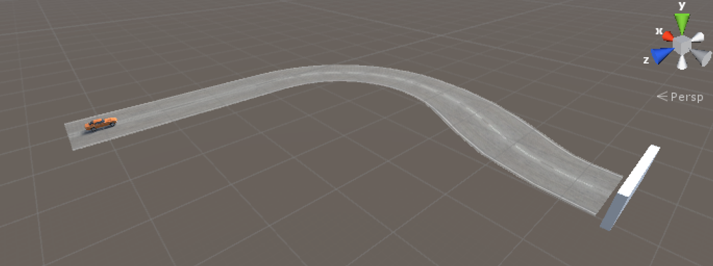
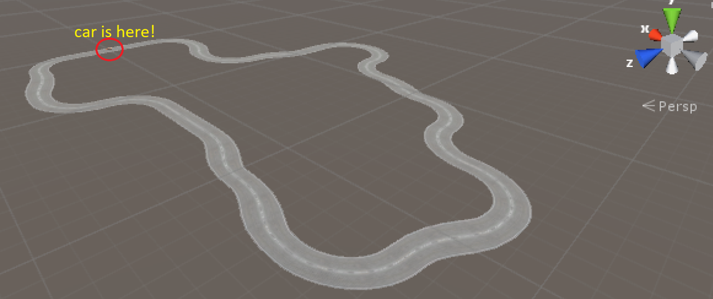
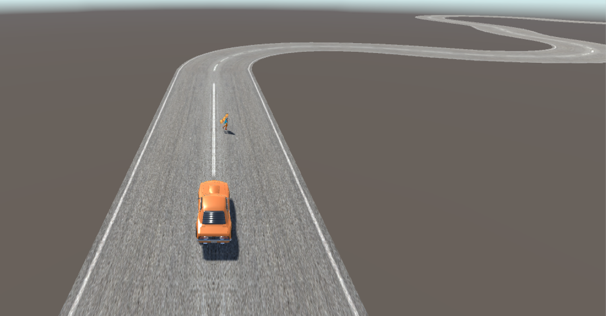

# Autocar

This directory contains three independent environments to train autonomous cars, using https://github.com/Unity-Technologies/ml-agents **version 0.1.1 (not the latest)**

Downloads
-------------------
The whole package of Unity environments can be downloaded from here : https://drive.google.com/open?id=1Xemb6YEXkzRjbF0-3NeWtrB4WxalxqwA
or directly cloned from this repository.

**Disclaimer : I do not own any assets included in this project**

List of assets used (all free):
-------------------
* [Car](https://www.assetstore.unity3d.com/en/#!/content/79854) (wheelcolliders manually added)
* [Roads](https://www.assetstore.unity3d.com/en/#!/content/66152) (tracks manually created)
* [Human(Unity-chan)](http://unity-chan.com/)

# Environments

The agent controls a car on a (partial or full) track. The agent tries to move the car to the goal, or to complete the whole track without falling. The agent is equipped with a camera in front of the car to tell the information of the track.

Manual control
-------------------
By default, the brain is set to `Player`, and the user can control the car using arrow keys. Before training, set it to `External` and build.

Structure of the environments
------------------
Agents are attached to the object called **Main**, which is responsible for all interactions between Unity and Python.

autocar
------------------

A partial track to experiment the environment.
* state size : 16x40 + 1
  1.  The camera has resolution 16(height)x40(width). It sees part of the sky and the track.
  2.  The forward velocity of the car (defined by the velocity dot product the normalized forward vector of the car)
* action size : 2, continuous
  1.  up or down
  2.  left or right
* rewards and *done* :
  * Every step : The norm of the forward velocity/5, to encourage forward movement. If it moves backwards, multiply the (negative) reward by 4.
  * When the car falls off the track, set reward to -50 and *done*.
  * When the car reaches the goal, set reward to 100 and *done*.
  
My approach : https://github.com/kwea123/RL/blob/master/ai/unity_test/autocar/autocar.ipynb

Use opencv to detect the edges of the track, and flatten the image as input, finally concatenate it with the velocity state. Training is done using PPO within 200 episodes.
  
autocar2
------------------

A complete track
* state size : 16x40 + 1
  1.  The camera has resolution 16(height)x40(width). It sees part of the sky and the track.
  2.  The forward velocity of the car (defined by the velocity dot product the normalized forward vector of the car)
* action size : 2, continuous
  1.  up or down
  2.  left or right
* rewards and *done* :
  * Every step : The norm of the forward velocity/5, to encourage forward movement. If it moves backwards, multiply the (negative) reward by 4.
  * When the car falls off the track, set reward to -50 and *done*.

Link to youtube video showing fully learnt car movements :
 [autocar](https://youtu.be/pHsxddQF0Tc)

My approach : https://github.com/kwea123/RL/blob/master/ai/unity_test/autocar/autocar2.ipynb

Based on the previous trained model, training is done after another 200 episodes.
  
autocar_human_detection
------------------

In addition to autocar2, a pedestrian randomly appears in front of the car, with distance from 7-12 units, and walking in a random direction (doesn't change until she falls from the track). If she falls, she will reappear in another random position, with another random direction.

* state size : 16x40 + 1 + 200x300
  1.  The camera has resolution 16(height)x40(width). It sees part of the sky and the track.
  2.  The forward velocity of the car (defined by the velocity dot product the normalized forward vector of the car)
  3.  Another front camera has resolution 200x300, which is responsible for detecting the pedestrian.
* action size : 2, continuous
  1.  up or down
  2.  left or right
* rewards and *done* :
  * Every step : The norm of the forward velocity/5, to encourage forward movement. If it moves backwards, multiply the (negative) reward by 4.
  * When the car falls off the track, set reward to -50 and *done*.
  
My approach :

In order to detect the pedestrian, we must at least know her distance and her direction. This can be done using traditional supervised learning provided with a large amount of data. Human detection is done using [Google object detection](https://github.com/tensorflow/models/tree/master/research/object_detection), and the images are labelled with the distance and the direction, stored in `/human_imgs/`.

Data generator : https://github.com/kwea123/RL/blob/master/ai/unity_test/autocar/autocar2_human_gendata.ipynb

The distance prediction model is trained using a 3-layer MLP, and the direction prediction model is trained using a 3-layer CNN.

Prediction models trainer : https://github.com/kwea123/RL/blob/master/ai/unity_test/autocar/direction_distance_trainer.ipynb

Next, based on the predictions, we (heuristically) defined a danger coefficient indicating whether the car should slow down or not.

Finally, the car moves first based on the model learnt in environment `autocar2`, then depending on the danger coefficient, it decides whether to slow down (no steering for the moment, it can be added in the future).

Final successful result : https://github.com/kwea123/RL/blob/master/ai/unity_test/autocar/autocar2_human_detection.ipynb
