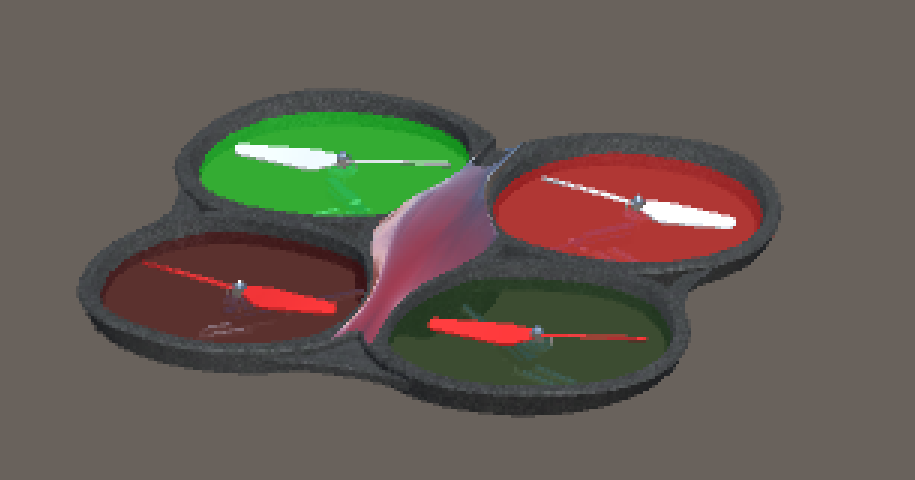
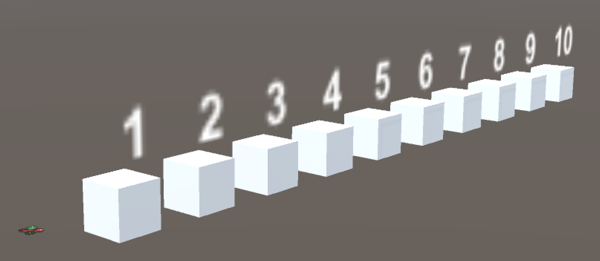
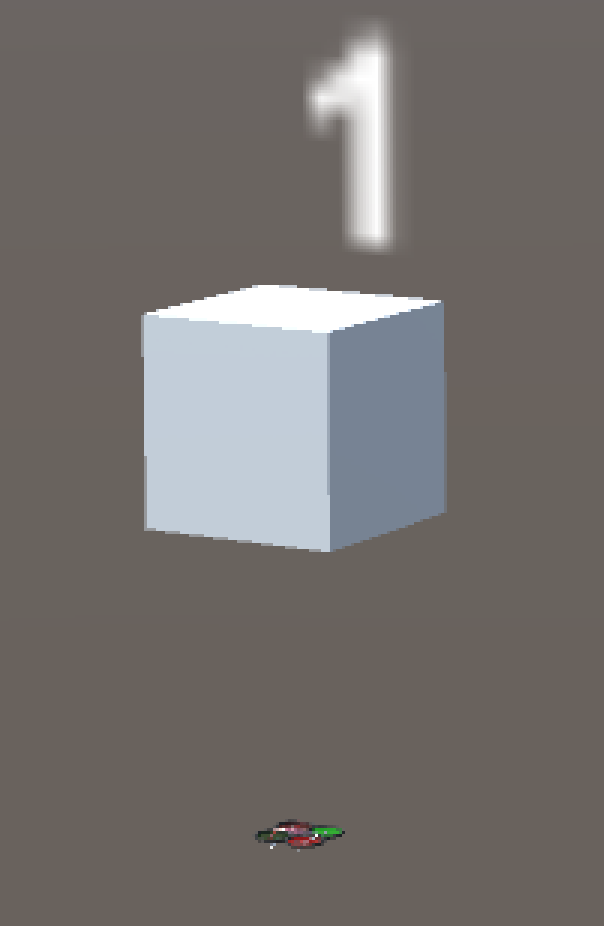
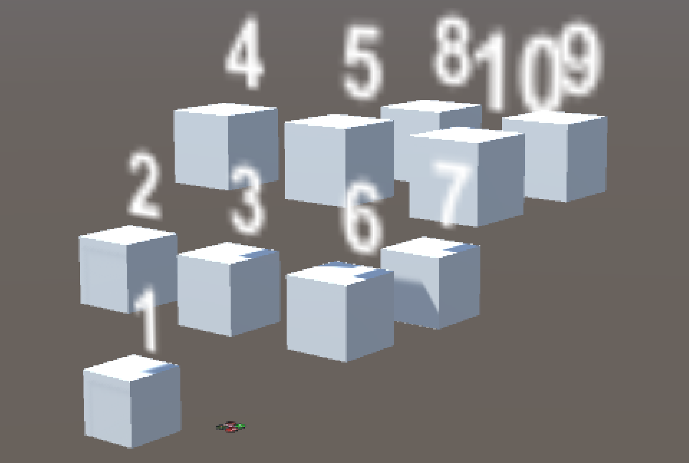
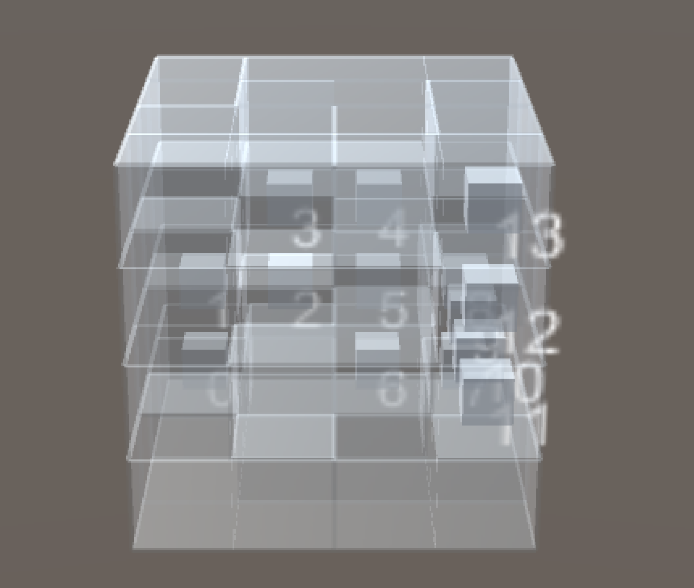
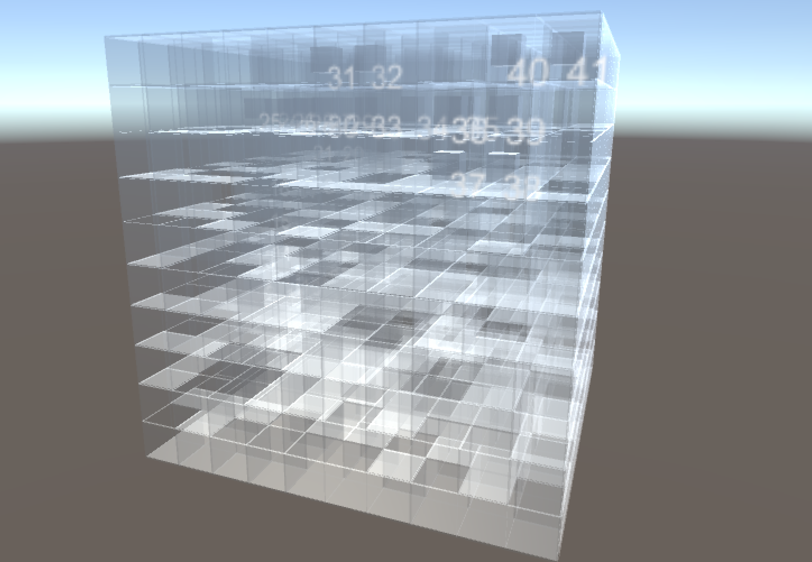
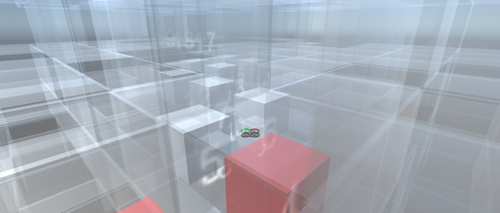

# Drone

This directory contains four independent environments to train a drone, using https://github.com/Unity-Technologies/ml-agents **version 0.1.1 (not the latest)**

List of assets used (all free):
-------------------
* [Drone](https://github.com/udacity/RoboND-QuadRotor-Unity-Simulator) (model is extracted from the scene)

# Environments

The agent controls a drone which can fly freely in the sky. The agent is given a path filled with cubes to follow, and the goal is to move the drone along the path by touching every cube in the correct order.

Manual control
-------------------
By default, the brain is set to `Player`, and the user can control the drone using arrow keys; to move up and down, use space and key c. To simulate the movement of the drone as precisely as possible, when moving in one direction (left/right/forward/backward), the drone is **slightly tilted** (with an angle of maximum 15 degrees, depending linearly on how large the input is). Therefore, to keep the drone at the same altitude, one **must increase the vertical thrust** as well, otherwise the drone will fall.

To see more details of how the physics is involved, [here](https://www.wired.com/2017/05/the-physics-of-drones/) is an easy-to-understand article.

Before training, set it to `External` and build.

Structure of the environments
------------------
Agents are attached to the object called **Main**, which is responsible for all interactions between Unity and Python.

forward
------------------

A straight line of 10 cubes to experiment the environment.
* state size : 15
  1. The angles of the drone (3 float numbers)
  2. The velocity of the drone (3 float numbers)
  3. The relative position to the next 3 cubes (3x3=9 float numbers)
* action size : 4, continuous
  1. Forces in the three directions (3 float numbers)
  2. Yaw (y-axis rotation) (1 float number)
* rewards and *done* :
   * Every step : -0.01 - (distance to the next cube/200) - (absolute difference between the y coordinate of the drone and the next cube)/100
   * When the drone reaches the next cube, reward = +10
   * When the distance to the next cube is > 4, reward = -10 and *done*
   * When all the cubes are reached, *done*
   
randomSequence1
------------------

A cube randomly appears in one of the four spots (left/right/front/back) adjacent to the drone of distance 0.5.
Same setup as the previous environment.

randomSequence1_3d
------------------

A cube randomly appears in one of the **six** spots (left/right/front/back/up/down) adjacent to the drone of distance 0.5.
Same setup as the previous environment.

randomSequence10_3d
------------------

**Ten** cubes are generated sequentially and randomly, each cube is adjacent to the precedent one of distance 0.5.
Same setup as the previous environment.

randomSequence50_3d
------------------

**50** cubes are generated sequentially and randomly, each cube is adjacent to the precedent one of distance 0.5.
Same setup as the previous environment.

Drone completing a 50-cube path :
[drone 50](https://youtu.be/ECAw-84YvPw)

maze4_3d
------------------

A 3d maze of size 4 is generated using [kruskal's algorithm](https://en.wikipedia.org/wiki/Maze_generation_algorithm#Randomized_Kruskal's_algorithm); as a property of this algorithm, **every pair of cells is linked by one unique simple path**. Hence, we randomly pick two cells in the maze and generate cubes on the path linking the cells (The path is found using [BFS](https://en.wikipedia.org/wiki/Breadth-first_search), and is guaranteed to be the shortest).

Same setup as the previous environment.

Drone completing a size 4 3d maze :
[drone maze4](https://youtu.be/edM7mxeRYlY)

maze10_3d
------------------

Inner view of the maze and the path : 

A 3d maze of size **10** is generated.

Same setup as the previous environment.

Drone completing a size 10 3d maze :
[drone maze10](https://youtu.be/e32YkK7myuE)

Drone completing a size 10 3d maze (smoother movement):
[drone maze10 sm](https://youtu.be/62P0yJCHeTI)
